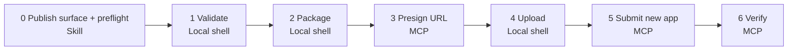
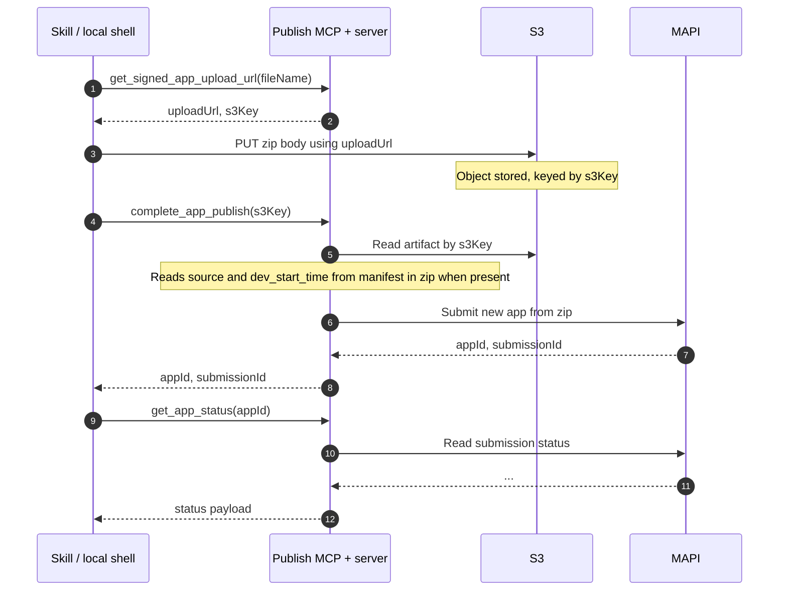

# Publish App — High-Level Design

**Scope of this document:** **New app** publish only (first marketplace submission) for **current scope**. **Version update** (new version of an existing app) and **`list_my_apps`** are **fast follow** — same delivery band, not required to ship **current scope** (details under **MCP tools** and **Open questions & future**).

## 0. Snapshot

| Capability | Today | Proposed |
|------------|-------|----------|
| Build app | Agent can build | Same |
| Setup FDK | Agent can set up FDK | Same |
| Publish (new app) | Manual | Automated (publish skill + MCP tools) |

**Goal:** Automate **first-time** custom app publishing to Freshworks Marketplace end-to-end.
**Gap:** Agent can build and set up FDK, but **new app** publishing is still manual.
**Ships:** 1 publish skill + **3 MCP tools (current scope)**; **`list_my_apps`** and **version update** (`update_app_version` + skill) as **fast follow** (see **MCP tools**).

---

## 1. Packaging, distribution & auth

### What ships

One plugin artifact — marketplace skills (app-dev, fdk-setup, publish) and mp-openai MCP definitions in the same repo/release. Cursor or Claude Code loads skills + tools as one unit.

### How the developer gets it

Install in Cursor or Claude Code by providing the GitHub repository link (or a published install URL). One link wires both skills and MCP — no separate install paths.

### MCP auth token

| Skill | Token required? | Details |
|-------|-----------------|---------|
| `fdk-setup` | Optional | Both are optional: (1) whether the skill asks at all, and (2) whether the developer provides one. Local FDK setup does not depend on a token. If supplied, the token is product-scoped. |
| `publish` | Mandatory | The skill must not call any **shipped** publish MCP tool until a valid token is configured for MAPI access. |

The token is scoped to a Freshworks product. All marketplace MCP calls apply only to that product — the app being published must match the token's product scope.

---

## 2. Publish flow (new app)

**Current scope** is **first marketplace submission for this workspace** (new listing), not “pick new app vs version update”—version update is **fast follow**. Step **0** is therefore **not** a branch on app lifecycle; it is the skill-owned **publish surface** and **preflight** (including **test / in-dev vs custom**).

Single diagram (left → right): first line of each node = **what**; second line = **where** (Skill, local shell, or MCP).

> **Publish surface:** the skill records **test / in-dev** vs **custom** (account-wide) before submit. That choice drives a future `publishType` on `complete_app_publish` — see **Open questions & future**. Other preflight (token present, product match, cwd / manifest sanity) stays in step **0** as well.

When **`list_my_apps`** ships **(fast follow)**, an optional **Discover** step can precede step **0** for naming collision checks — not required for **current scope**.

---

## 3. MCP tools

**Current scope contract (this doc):** three tools for **new app** publish. **`list_my_apps`** and **`update_app_version`** are **fast follow**—same priority band **after current scope**, not part of the **current scope** three-tool set (see **Open questions & future**).

### Build phases

| Phase | Tool | Why |
|-------|------|-----|
| Current scope | `get_signed_app_upload_url` | Upload handoff |
| Current scope | `complete_app_publish` | Submit **new** app to MAPI |
| Current scope | `get_app_status` | Verify submission landed |
| Fast follow | `list_my_apps` | Optional discovery / naming context before publish |
| Fast follow | `update_app_version` | Submit **new version** of existing app to MAPI (same S3 handoff pattern as `complete_app_publish`) |

| # | Tool | Input | Output |
|---|------|-------|--------|
| 1 | `get_signed_app_upload_url` | `fileName` | `uploadUrl`, `s3Key`, `expiresInSeconds` |
| 2 | `complete_app_publish` | `s3Key` | `appId`, `submissionId`, `status` |
| 3 | `get_app_status` | `appId` | `{ appId, name, status, version, lastUpdated }` |
| 4 | `list_my_apps` | `product?`, `status?`, `type?` | `[{ appId, name, status, version, … }]` *(fast follow)* |
| 5 | `update_app_version` | `appId`, `s3Key`, … | `submissionId`, `status` *(fast follow)* |

### Artifact path

Zip never flows through MCP. The agent uploads directly to S3 via a presigned URL (short-lived handoff bucket/prefix). The server pulls from S3 on submit and POSTs to MAPI. **IDs** (`fileName`, `uploadUrl`, `s3Key`, `appId`, manifest `source` / `dev_start_time`, …): **IDs & data lineage**.

### Error handling (MCP auth)

On **401 / 403** (or equivalent auth failure) from any **current scope** publish MCP tool, the **publish skill** stops at that step, reports the error, and prompts the developer to refresh or reconfigure the **MCP auth token**. After a valid token is configured, the flow **resumes from the failed step**. If the zip is already valid and on disk, there is **no need to re-run validate or package**—only repeat from the MCP step that failed (e.g. presign again, retry submit, or retry status).

### Idempotency & retries

| Tool | Behavior |
|------|----------|
| `get_signed_app_upload_url` | **Safe to retry.** Each call may mint a new `uploadUrl` / `s3Key`; the skill picks up the latest pair for upload. |
| `complete_app_publish` | **`s3Key` is the natural idempotency key** for a given artifact: the server should treat a repeat submit with the same `s3Key` as the **same logical submission** (return the existing `submissionId` / status, or dedupe)—not create a duplicate marketplace listing. Exact behavior depends on **server + MAPI** contract. |
| `get_app_status` | **Safe to retry** for polling. |

### `complete_app_publish` input (current scope)

**Client input is only `s3Key`.** The server reads app metadata (name, product, type, description, icon, and any other required fields) from the **manifest and assets inside the uploaded zip**. No extra MCP parameters are required for **current scope** unless product discovers gaps—see **Open questions**.

### Presigned URL expiry

**Current scope:** presigned PUT URL TTL is **900 seconds (15 minutes)**, **not** client-configurable; `get_signed_app_upload_url` continues to return `expiresInSeconds` for transparency. That window is intended to be sufficient for typical zips (order of **~50 MB** on normal connections). If upload fails because the URL expired, the skill calls **`get_signed_app_upload_url` again** for a fresh `uploadUrl` / `s3Key`; the **prior `s3Key`** may be left unused and should be **reclaimed by a staged-object lifecycle policy** (bucket rules or periodic cleanup—**owner TBD**, infra + product).

---

## 4. IDs & data lineage

How identifiers are created, passed between skill / shell / MCP / MAPI, and where they land for metrics and server-side logs. **`mcp_auth_token`** is the same credential as the **MCP auth token** under **Packaging, distribution & auth** (product-scoped). Fast-follow tools extend this table when shipped.

### Every ID in the publish flow

| ID | What it is | Born at | Consumed by | Lives in | Purpose |
|----|-------------|---------|---------------|----------|---------|
| `mcp_auth_token` | Developer's MAPI credential | Developer (manual config) | All 3 MCP tools (auth header) | Client-side config | AuthN + product scoping |
| `fileName` | Name of the zip | Skill (local) | `get_signed_app_upload_url` | Transient | S3 object naming |
| `uploadUrl` | Pre-signed S3 PUT URL | `get_signed_app_upload_url` | `curl` PUT (local shell) | Transient (expires) | One-time upload |
| `s3Key` | Reference to uploaded zip | `get_signed_app_upload_url` | `complete_app_publish` | Server-side (S3) | Links upload → submission |
| `appId` | Permanent marketplace app ID | `complete_app_publish` | `get_app_status`, metrics, future `update_app_version` | MAPI database | Long-lived app identity |
| `submissionId` | MAPI submission record | `complete_app_publish` | `get_app_status`, server logs | MAPI database | Tracks review / approval lifecycle |
| `source` | What built this app (e.g. skill id + version) | app-dev skill → manifest | Publish server (reads from zip) on submit | App manifest inside zip | Build origin attribution |
| `dev_start_time` | Timestamp when app-dev session started | app-dev skill → manifest | Publish server (reads from zip) | App manifest inside zip | Metric: dev duration |
| `publish_timestamp` | Timestamp of submission | Publish server (on submit) | Metrics pipeline | Server-side logs | Metric: `publish_timestamp - dev_start_time` |
| `invoked_by` | Agent / session identity | MCP session context (auto) | Per-tool log (**Metrics**) | Server-side logs | Publish origin attribution |

### ID chain through the flow

Who passes which identifier. **Publish MCP** here means the tool surface plus **server-side** work (presign mint, S3 read on submit, MAPI calls).

**Manifest IDs (before MCP):** proposal is for **app-dev** to write **`source`** next to **`dev_start_time`** when a **new app** session starts. Both live in the **app manifest inside the zip** so the publish server can read them on **`complete_app_publish`** (no new MCP parameter for `source` in current scope).

### Manifest behavior & known limits

- **Version update (later):** when version-update publish ships, **`dev_start_time`** reset rules for upgrade sessions are defined with that feature (see **Open questions & future**).
- **Multi-developer overwrites:** the manifest fields (`source`, `dev_start_time`) are per-zip, not per-user, so they can be overwritten on shared workspaces. Acceptable for **current scope**; **fast follow** should define **build-time / attribution** when several people touch the same app (see **Fast follow** under **Open questions & future**), alongside **version-update metrics**.

---

## 5. Metrics

**Lineage:** identifier birth/consumption — **IDs & data lineage**.

### Metric capture

| Metric / signal | Formula / signal | IDs required | Source of truth | Available when |
|-----------------|------------------|--------------|-----------------|----------------|
| App development time | `publish_timestamp − dev_start_time` | `appId`, `dev_start_time`, `publish_timestamp` | Manifest + server | app-dev wrote `dev_start_time` **and** publish path recorded timestamps |
| App build origin | `source` from manifest | `appId`, `source` | Manifest in zip | app-dev wrote `source` before zip upload |
| App publish origin | `invoked_by` from MCP session | `appId`, `invoked_by` | MCP session context | Any publish that hit MCP tools |

**Fast follow:** **version-update metrics** and **build time when multiple developers** work on the same app are not fully specified here—see **Fast follow** under **Open questions & future** (and the manifest limits note under **IDs & data lineage**).

### Coverage matrix (first publish only)

Per **build** × **publish** path: whether `source` / `dev_start_time` are in the manifest zip, whether MCP `invoked_by` exists, what **dev time** and **build origin** can be, and **handling** (product / MAPI dependency). Drives **Metric capture** and the **per-tool log** below.

| # | Built by | Published by | `source` in manifest | `dev_start_time` in manifest | `invoked_by` | Dev time | Build origin | Handling |
|---|----------|--------------|------------------------|------------------------------|--------------|----------|----------------|----------|
| 1 | Skill | Skill | ✅ | ✅ | ✅ | ✅ Computed | ✅ From manifest | Full telemetry |
| 2 | Manual | Skill | absent | absent | ✅ | null | `manual` (inferred) | Server defaults |
| 3 | Skill | Manual | ✅ in zip | ✅ in zip | ❌ | ⚠️ Available if MAPI reads it | ⚠️ Available if MAPI reads it | MAPI dependency |
| 4 | Manual | Manual | ❌ | ❌ | ❌ | ❌ Lost | ❌ Lost | Out of scope |

### Bottom line — four fields, four questions

| Field | Question | Set by | Set when |
|-------|----------|--------|----------|
| `source` | What **built** this app? | app-dev skill → manifest | App creation |
| `dev_start_time` | When did **building** start? | app-dev skill → manifest | App creation |
| `invoked_by` | What **published** this app (via MCP)? | MCP session context (auto) | Each MCP tool call |
| `publish_timestamp` | When was it **published**? | Publish server (on submit) | Submission |

### Per-tool log

All **current scope** publish MCP tools emit rows via **MCP session context** (**3 tools**; add **`list_my_apps`** and **`update_app_version`** when fast follow ships). Log sink and retention are out of scope here — below is the **field contract** per call (feeds the **Metric capture** and **Coverage matrix** tables above).

| Tool call | Fields logged |
|-----------|---------------|
| `get_signed_app_upload_url` | `invoked_by`, `timestamp`, `fileName`, `s3Key` |
| `complete_app_publish` | `invoked_by`, `timestamp`, `s3Key`, `appId`, `submissionId`, `dev_start_time`, `source` *(from zip manifest, when present)* |
| `get_app_status` | `invoked_by`, `timestamp`, `appId` |

---

## 6. Overlap concerns (skill vs MCP)

**Why here:** **Open questions & future** includes precedence when skills and MCP both exist; this section states the design rule publish follows and contrasts it with app-dev today.

**Rule:** the **skill orchestrates** (prompts, ordering, local shell); **MCP tools execute** server-backed steps. **One owner per capability**—do not mirror the same job in a loaded skill and a tool.

### app-dev overlap today (problem)

| Capability | Skill | MCP tool | Overlap? |
|------------|-------|----------|----------|
| Workflow guidance | Yes | Yes — `get_impl_plan` | Duplicate |
| App details | Yes | Yes — `get_app_details` | Duplicate |
| Code generation | Yes | Yes — `implement_app` | Duplicate |
| Developer docs (RAG) | No | Yes — `get_developer_docs` | Clean |

The **new-app** publish flow from **Publish flow (new app)** through **Metrics** keeps presign / submit / verify on MCP and **publish surface + preflight** / validate / zip / upload on the skill or local shell so reviewers can check ownership without guessing.

---

## 7. Open questions & future

### Open questions

| # | Question | Comments |
|---|----------|-------|
| 1 | Which MAPI endpoints exist vs need to be built for **create-from-zip**? | Open |
| 2 | app-dev skill needs to write `dev_start_time` and **`source`** to manifest — when exactly? | first thing to do |
| 3 | For manual publish (no app-dev), can we capture anything at MAPI level? | Open|
| 4 | When skills and MCP overlap (e.g. app-dev), should MCP tool descriptions state that **loaded skills take precedence**? |  Open |
| 5 | For **create-from-zip**, does MAPI accept **metadata only from manifest + assets in the zip**, or does it require **extra fields** not present there? (Drives whether `complete_app_publish` stays `s3Key`-only.) | Open |

### Fast follow (after current scope)

| Item | Notes |
|------|--------|
| **`list_my_apps`** | Optional **Discover** step before publish surface / preflight; naming / collision context |
| **Version update publish** | `update_app_version` MCP tool + publish skill branch (changelog, existing `appId`); same S3 ingest pattern as `complete_app_publish`; MAPI version-update readiness |
| **Version-update metrics** | First publish is not enough: define **per-version** signals (e.g. time since prior approved version, review cycle for the submission, optional “edit start” for a version bump). Likely needs **new or clarified fields** (manifest, MAPI, or server-side session) so `publish_timestamp − dev_start_time` is not reused blindly when the “build” is really an upgrade branch. |
| **Build time with multiple developers** | Manifest-only `dev_start_time` / `source` break down when **many devs** share a repo or overwrite the zip path. **Fast follow** should specify **server-side session tracking**, **per-invoker** or **per-session** build start, and/or **VCS-aware** anchors so **build duration** and **build origin** stay meaningful at team scale—aligned with version-update work so first-publish and upgrade paths share one model where possible. |
